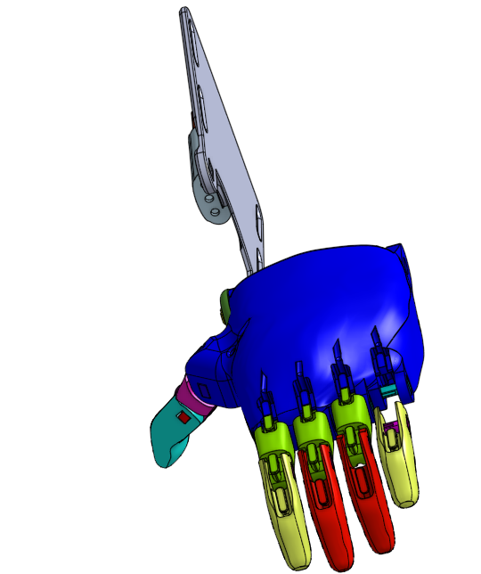
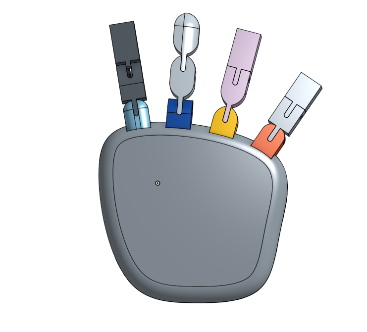
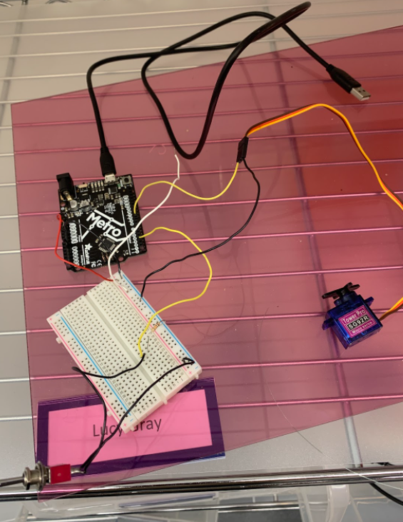
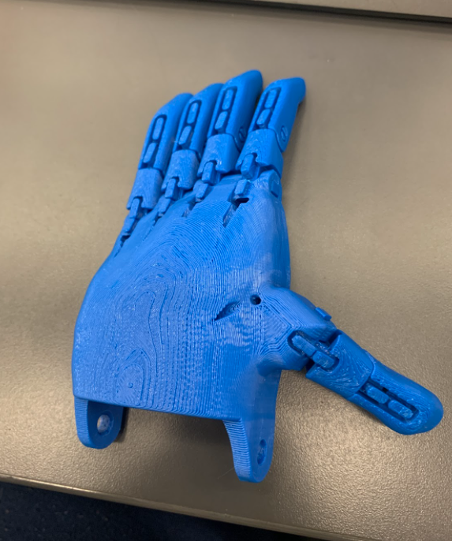

# Robot-Arm
This was a project with the purpose to block out your phone while you're working and cover it but, but we didn't finish it yet.

# Design
we had multiple designs and changed the shape of lots of things while we were building it together. this is our final product for the design

# Hand
we had two diffrent hands and at the very last minute we switched up and chose a diffrent hand, and the new hand is actually better

thats the new hand above and here's the old hand

# Pieces
we printed out the new hand but with the lack of dental bands we only assembled it
here's the real hand
and also the wiring 

# Documentation
there wasn't much documentation but all the planning was on this google doc.
https://docs.google.com/document/d/1JagedNZsGMul48KZmvfa4X2Rq88BIXiYmFTGOAQENBg/edit?scrlybrkr=2e170b75
